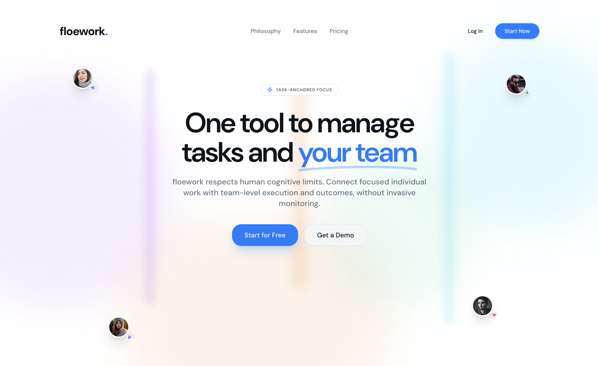

# floework — Human-Aware SaaS Productivity & Team Collaboration Platform



---

## 1. Introduction

### 1.1 Background
Modern software teams rely on multiple tools for managing work and collaboration. Commonly used platforms include tools for documentation and planning, team communication, task tracking, and time logging. While each tool is effective in isolation, their combined usage introduces fragmentation across focus, execution, and visibility.

Teams commonly experience:
- Excessive context switching
- Invisible individual effort
- Burnout caused by misaligned expectations
- Lack of causal linkage between work done and outcomes delivered

This project proposes a single integrated SaaS platform that unifies task execution, collaboration, and personal productivity, with a core focus on human cognitive limits and sustainable execution.

---

### 1.2 Problem Statement
Existing productivity systems optimize for process tracking and managerial visibility, but fail to capture:
- Focus quality
- Cognitive cost of interruptions
- Relationship between effort and task completion

As a result, teams often:
- Work harder without shipping faster
- Misinterpret delays as inefficiency
- Increase pressure, leading to burnout

**Problem Definition**
To design and implement a scalable SaaS-based web platform that directly links focused individual work with team-level task progress, providing actionable insights without invasive monitoring.

---

### 1.3 Objectives
- Reduce context switching through integrated workflows
- Make effort visible without surveillance
- Align personal productivity with team outcomes
- Respect human focus limitations
- Provide real-time, causally meaningful analytics

---

## 2. Comparative Study of Existing Systems

### 2.1 Limitations of Current Tool Stack

| Tool Category | Primary Strength | Structural Limitation |
|---|---|---|
| Documentation & Planning | Knowledge organization | Static, execution-blind |
| Team Communication | Fast coordination | High interruption, low memory |
| Task Tracking | Process visibility | Outcome-only visibility |
| Time Tracking | Effort logging | Manual, context-free |

Despite integrations, these tools do not share a unified execution state.

---

### 2.2 Identified Gap
No existing platform models the full causal chain:

**Focus → Effort → Task Progress → Team Outcome**

This gap forms the foundation of the proposed system.

---

## 3. Proposed System Overview

### 3.1 System Description
floework is a multi-tenant SaaS web platform designed for small to mid-sized technical teams, where:
- Tasks are the anchor unit
- Focus sessions are first-class entities
- Real-time visibility is non-invasive
- Analytics explain why outcomes occur

---

### 3.2 Target Users
- Remote-first development teams (3–15 members)
- Student project and hackathon teams
- Indie developers and startup engineering teams

---

## 4. System Architecture

### 4.1 Architectural Style
- Layered Architecture
- Event-Driven Backend
- Client–Server Model
- Service-Oriented Design

---

### 4.2 High-Level Architecture

**Layers**
1. Frontend Layer
2. Middleware & Validation Layer
3. Backend Services Layer
4. External Services Layer

```text
User Browser
   ↓
Frontend (React)
   ↓
Middleware (Auth, Validation, RBAC)
   ↓
Backend Services (Node.js)
   ↓
PostgreSQL / Redis / WebSockets / Cloud Services
```

---

## 5. Frontend Architecture

### 5.1 Responsibilities
- User authentication
- Task and project dashboards
- Focus session interface
- Real-time collaboration updates
- Analytics visualization

---

### 5.2 Technology Stack
- React (component-based UI)
- Redux Toolkit (state management)
- Tailwind CSS
- Socket.IO Client
- Chart.js

*(Note: Currently built with Vite, React Query, Recharts, shadcn-ui in the prototype)*

---

### 5.3 Component Structure
- Authentication Module
- Dashboard Module
- Project & Task Module
- Productivity Zone
- Analytics Module

---

## 6. Middleware & Validation Layer

### 6.1 Responsibilities
- JWT authentication
- OAuth token validation
- Role-Based Access Control (RBAC)
- Input schema validation
- Subscription enforcement
- Rate limiting and centralized error handling

---

### 6.2 Request Processing Pipeline
1. Authentication verification
2. Role authorization
3. Request validation
4. Subscription check
5. Controller execution

---

## 7. Backend Architecture

### 7.1 Technology Stack
- Node.js
- Express.js
- Socket.IO
- Stripe API
- AWS SDK

---

### 7.2 Core Backend Services
- Authentication Service
- Project & Task Service
- Focus Session Engine
- Real-Time Event Service
- Analytics Service
- Billing & Subscription Service

---

### 7.3 API Design
- RESTful endpoints
- Versioned APIs
- Stateless requests
- JSON-based communication

---

## 8. Database Design

### 8.1 Database Architecture
The system adopts a dual-database architecture:
- **PostgreSQL** as the primary relational database
- **Redis** as an in-memory data store for caching and real-time state

This separation ensures strong consistency for critical data and low-latency access for live system behavior.

---

### 8.2 Primary Database — PostgreSQL
**Role**
- Source of truth for persistent data
- Supports relational integrity and analytical queries

**Stored Data**
- Users and authentication metadata
- Teams and roles
- Projects and tasks
- Historical focus sessions
- Productivity logs
- Subscriptions and payment records

---

### 8.3 In-Memory Store — Redis
**Role**
- Real-time system state
- Low-latency data access
- Temporary and derived data

**Used For**
- Active focus sessions
- “In focus” presence indicators
- WebSocket connection mappings
- Rate limiting counters
- Short-lived analytics aggregates
- Session and token storage

Redis data is periodically persisted to PostgreSQL where required.

---

### 8.4 Core Entities
- User
- Role
- Team
- Project
- Task
- FocusSession
- ProductivityLog
- Subscription
- Payment

---

### 8.5 Key Relationships
- One team → many users
- One project → many tasks
- One task → many focus sessions
- One user → many focus sessions
- One user → one subscription

---

## 9. Core SaaS Features
To ensure the platform acts as a fully functional SAAS product, the following core features are integrated:
- **Flow Board Enhancements**: Fully functional task creation, assignment (adding people), and calendar views.
- **Starred Items**: Ability to star or bookmark projects, tasks, or conversations for quick access.
- **Messages**: In-app messaging and team communication channels to keep context tied to work.
- **Profile Management**: User profiles for managing personal details, preferences, and roles.
- **Alerts & Notifications**: Real-time alerts for task updates, mentions, and system events.

---

## 9. Productivity Zone (Core Innovation)

### 9.1 Focus Session Engine
- Task-linked focus sessions
- Timer-based execution
- Pause, resume, and interruption detection
- Session metadata logging

---

### 9.2 Productivity Logger
- Tracks duration, interruptions, and task association
- No content, keystroke, or screen logging
- Privacy-first by design

---

### 9.3 Analytics Engine
Computes:
- Focus-to-completion ratio
- Interrupted session frequency
- Hidden bottlenecks
- Burnout risk indicators

---

## 10. Real-Time Collaboration

### 10.1 WebSocket-Based Updates
- Task state changes
- Focus session presence
- Project activity feeds

---

### 10.2 Team Awareness Features
- “In focus” indicators
- Non-intrusive status visibility
- Async-friendly collaboration model

---

## 11. Security Design

### 11.1 Authentication & Authorization
- JWT-based authentication with expiration
- Secure refresh token handling
- Role-based permission enforcement

---

### 11.2 Data Protection
- HTTPS enforced across all services
- Encryption of sensitive fields at rest
- Secure cloud storage access policies

---

## 13. Deployment & DevOps

### 13.1 Cloud Infrastructure
The platform is deployed on AWS, initially leveraging free-tier resources for development and evaluation.

---

### 12.2 Deployment Strategy
- **Frontend**: Static build hosted on object storage and CDN
- **Backend**: Containerized Node.js services
- **Database**: Managed PostgreSQL instance
- **Cache**: Redis hosted on compute instance

---

### 12.3 CI/CD Pipeline
- Source control–triggered builds
- Automated testing and linting
- Container image creation
- Continuous deployment to cloud infrastructure

---

### 12.4 Scalability Path
- Redis → Managed in-memory cache service
- Single-instance backend → Container orchestration
- Database → Multi-AZ PostgreSQL with read replicas

---

## 13. Testing Strategy

| Test Type | Scope |
|---|---|
| Unit Testing | Business logic |
| Integration Testing | API and database |
| End-to-End Testing | User workflows |
| Load Testing | Concurrent usage scenarios |

---

## 14. Limitations
- Not designed for large enterprise organizations
- Focused primarily on technical teams
- Relies on user honesty for focus session usage

---

## 15. Future Enhancements
- AI-based task summarization
- Intelligent workload prediction
- Team productivity benchmarking
- Mobile application support

---

## 16. Conclusion
floework addresses a structural gap in modern productivity systems by integrating:
- Task execution
- Human focus awareness
- Real-time collaboration
- Outcome-driven analytics

Unlike fragmented toolchains, the system models causality between effort and delivery, enabling healthier, more predictable team performance.

The project demonstrates strong system design capability, real-world problem understanding, and beyond-syllabus engineering depth suitable for academic evaluation, technical interviews, and portfolio presentation.
