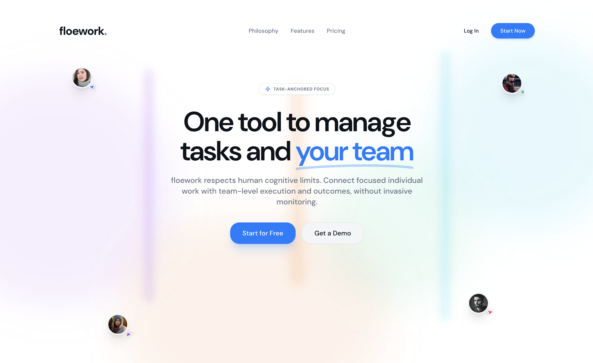

# floework

A human-aware SaaS productivity and team collaboration platform. floework aligns individual focus with team outcomes by integrating task execution, real-time collaboration, and actionable analytics—without invasive monitoring.



## Key Features

- **FlowBoard**: Kanban and calendar task management with real-time state sync.
- **Focus Engine**: Task-anchored focus sessions that track effort and cognitive load.
- **Execution Intelligence**: Bottleneck detection, burnout risk tracking, and focus stability maps.
- **Real-Time Collaboration**: WebSocket-based presence ("in-focus" indicators) and instant task updates.

## Tech Stack

- **Frontend**: React (Vite), Redux Toolkit, Tailwind CSS, shadcn/ui.
- **Backend**: Node.js, Vercel Serverless Functions (`/api`), Socket.IO.
- **Database & Auth**: PostgreSQL via Supabase, Redis (for real-time caching).

## Project Structure

```text
floework/
├── api/            # Serverless functions & backend endpoints
├── apps/web/       # Main React frontend application
├── supabase/       # Database migrations, seed data, and configuration
├── docker/         # Containerization scripts and configurations
└── docs/           # Detailed project documentation
```

## Local Development

### Prerequisites
- Node.js (v18+)
- npm or pnpm
- Supabase CLI

### Setup Instructions

1. **Install dependencies:**
   ```bash
   npm install
   ```

2. **Configure environment:**
   Copy the example environment file and add your Supabase credentials:
   ```bash
   cp .env.example .env.local
   ```

3. **Start local database:**
   ```bash
   supabase start
   ```

4. **Run development server:**
   ```bash
   cd apps/web && npm run dev
   ```
   The web app will be available at `http://localhost:5173`.

## Deployment

The repository is configured for deployment on Vercel.

```bash
vercel --prod
```
*(Ensure Supabase migrations are applied to your production database.)*
