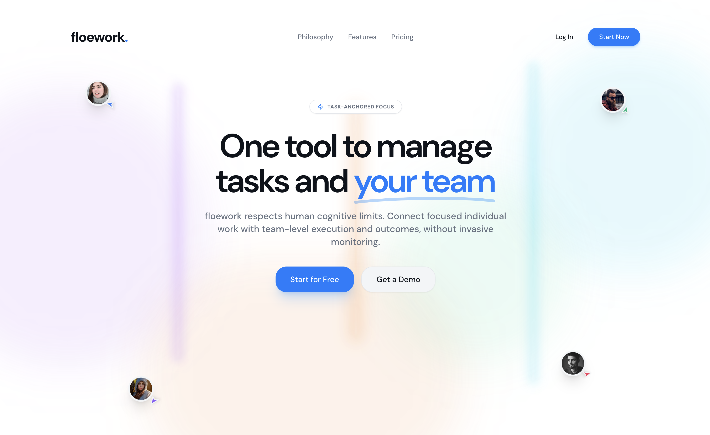
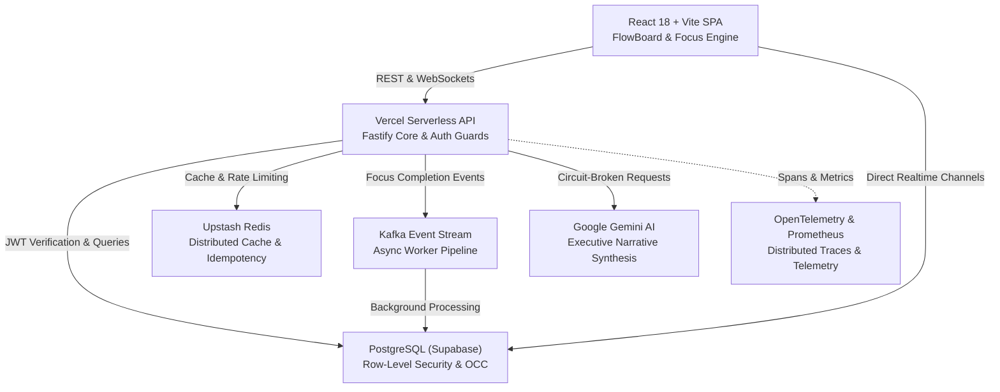

<a id="readme-top"></a>

<!-- PROJECT SHIELDS -->
[![Contributors][contributors-shield]][contributors-url]
[![Forks][forks-shield]][forks-url]
[![Stargazers][stars-shield]][stars-url]
[![Issues][issues-shield]][issues-url]
[![MIT License][license-shield]][license-url]
[![TypeScript][typescript-shield]][typescript-url]
[![Supabase][supabase-shield]][supabase-url]
[![Vercel][vercel-shield]][vercel-url]

<!-- PROJECT LOGO -->
<br />
<div align="center">
  <a href="https://github.com/Atharva-Mendhulkar/floework">
    
  </a>

  <h1 align="center">floework</h1>

  <p align="center">
    A human-aware execution platform for focused teams, linking task-level focus sessions with real-time progress, distributed concurrency control, and executive telemetry.
    <br />
    <a href="project.md"><strong>Explore the architecture documentation »</strong></a>
    <br />
    <br />
    <a href="https://floework.vercel.app">View Live Demo</a>
    &middot;
    <a href="https://github.com/Atharva-Mendhulkar/floework/issues/new?labels=bug">Report a bug</a>
    &middot;
    <a href="https://github.com/Atharva-Mendhulkar/floework/issues/new?labels=enhancement">Request a feature</a>
  </p>
</div>

<!-- TABLE OF CONTENTS -->
<details>
  <summary>Table of Contents</summary>
  <ol>
    <li>
      <a href="#about-the-project">About The Project</a>
      <ul>
        <li><a href="#key-architectural-pillars">Key Architectural Pillars</a></li>
        <li><a href="#how-it-works">How It Works</a></li>
        <li><a href="#built-with">Built With</a></li>
      </ul>
    </li>
    <li>
      <a href="#getting-started">Getting Started</a>
      <ul>
        <li><a href="#prerequisites">Prerequisites</a></li>
        <li><a href="#installation">Installation</a></li>
        <li><a href="#environment-configuration">Environment Configuration</a></li>
      </ul>
    </li>
    <li>
      <a href="#usage-and-commands">Usage and Commands</a>
      <ul>
        <li><a href="#running-locally">Running Locally</a></li>
        <li><a href="#available-scripts">Available Scripts</a></li>
      </ul>
    </li>
    <li><a href="#distributed-systems-and-resilience">Distributed Systems & Resilience</a></li>
    <li><a href="#verification-and-testing">Verification & Testing</a></li>
    <li><a href="#api-reference">API Reference</a></li>
    <li><a href="#roadmap">Roadmap</a></li>
    <li><a href="#contributing">Contributing</a></li>
    <li><a href="#license">License</a></li>
    <li><a href="#contact">Contact</a></li>
    <li><a href="#acknowledgments">Acknowledgments</a></li>
  </ol>
</details>

<!-- ABOUT THE PROJECT -->
## About The Project

<p align="center">
  
</p>

**floework** is a human-aware SaaS execution platform engineered for high-velocity teams. Rather than relying on invasive tracking or shallow status boards, floework pairs real-time collaborative task execution with quantified focus sessions and AI-synthesized delivery narratives.

It is built with strict multi-tenant isolation, version-based Optimistic Concurrency Control (OCC), circuit-broken external integrations, and OpenTelemetry-instrumented serverless handlers.

Read [project.md](project.md) for the complete architecture audit, cloud migration blueprint, and security threat model.

<p align="right">(<a href="#readme-top">back to top</a>)</p>

### Key Architectural Pillars

* **FlowBoard**: Advanced Kanban board with `@dnd-kit/core` drag-and-drop mechanics, multi-stage state transitions, and real-time WebSocket synchronization across project collaborators.
* **Focus Engine**: Micro-session execution tracker measuring active focus intervals, session interruptions, and team-wide presence indicators without invasive screen capture or keylogging.
* **Optimistic Concurrency Control (OCC)**: Zero-lock conflict mitigation using monotonically increasing `tasks.version` sequencing. Simultaneous edits return `HTTP 409 Conflict`, log tenant-isolated conflict metadata, and trigger client-side jittered state reconciliation.
* **Executive AI Narrative**: Automated standup and delivery synthesis powered by **Google Gemini 1.5 Flash**, wrapped in an Upstash Redis cache and an `opossum` Circuit Breaker to prevent cascading failures.
* **Strict Multi-Tenant Isolation**: Hardened PostgreSQL Row Level Security (RLS) with caller-context verification (`team_members`), cryptographic invite tokens (256-bit entropy via `crypto.randomBytes`), and security-invoker observability views.

<p align="right">(<a href="#readme-top">back to top</a>)</p>

### How It Works


```mermaid
flowchart TD
    Client["React 18 + Vite SPA<br/>FlowBoard & Focus Engine"]
    BFF["Vercel Serverless API<br/>Fastify Core & Auth Guards"]
    Supabase["PostgreSQL (Supabase)<br/>Row-Level Security & OCC"]
    Redis["Upstash Redis<br/>Distributed Cache & Idempotency"]
    Kafka["Kafka Event Stream<br/>Async Worker Pipeline"]
    Gemini["Google Gemini AI<br/>Executive Narrative Synthesis"]
    OTel["OpenTelemetry & Prometheus<br/>Distributed Traces & Telemetry"]

    Client -->|REST & WebSockets| BFF
    Client -->|Direct Realtime Channels| Supabase
    
    BFF -->|JWT Verification & Queries| Supabase
    BFF -->|Cache & Rate Limiting| Redis
    BFF -->|Focus Completion Events| Kafka
    BFF -->|Circuit-Broken Requests| Gemini
    BFF -.->|Spans & Metrics| OTel

    Kafka -->|Background Processing| Supabase
```

1. **User Action**: The client triggers task transitions or initiates a focus session.
2. **Identity & Authorization**: Every API mutation enforces caller JWT validation via `getUser` and project membership via `requireProjectMember`.
3. **OCC Validation**: Task mutations compare client version against database version. Conflicting writes generate structured conflict entries in `concurrency_conflicts` with tenant `team_id` tagging.
4. **Decoupled Processing**: Heavy events (such as focus completion summaries) are published asynchronously via Kafka to prevent serverless execution timeouts.

<p align="right">(<a href="#readme-top">back to top</a>)</p>

### Built With

* [![React][react-shield]][react-url]
* [![TypeScript][typescript-shield]][typescript-url]
* [![Vite][vite-shield]][vite-url]
* [![TailwindCSS][tailwind-shield]][tailwind-url]
* [![Supabase][supabase-shield]][supabase-url]
* [![PostgreSQL][postgres-shield]][postgres-url]
* [![Redis][redis-shield]][redis-url]
* [![Kafka][kafka-shield]][kafka-url]
* [![Gemini][gemini-shield]][gemini-url]
* [![OpenTelemetry][otel-shield]][otel-url]
* [![Vitest][vitest-shield]][vitest-url]
* [![Zod][zod-shield]][zod-url]

<p align="right">(<a href="#readme-top">back to top</a>)</p>

<!-- GETTING STARTED -->
## Getting Started

### Prerequisites

* **Node.js**: v20 or newer (tested with v24.x)
* **npm**: v10 or newer
* **Supabase Account / CLI**: Local instance or remote project (`vlozimkyxyyigclfdntp.supabase.co`)

### Installation

1. Clone the repository:
   ```sh
   git clone https://github.com/Atharva-Mendhulkar/floework.git
   cd floework
   ```

2. Install root and workspace dependencies:
   ```sh
   npm install
   ```

3. Configure your local environment file:
   ```sh
   cp .env.example .env.local
   ```

### Environment Configuration

Configure [`.env.local`](.env.local) with your Supabase credentials:

```ini
# Supabase Configuration
NEXT_PUBLIC_SUPABASE_URL="https://your-project.supabase.co"
NEXT_PUBLIC_SUPABASE_PUBLISHABLE_KEY="your-anon-or-publishable-key"
SUPABASE_URL="https://your-project.supabase.co"
SUPABASE_ANON_KEY="your-anon-or-publishable-key"
SUPABASE_SERVICE_ROLE_KEY="your-service-role-key"

# AI Narrative
GEMINI_API_KEY="your-gemini-api-key"

# Redis & Streaming (Optional for local dev)
UPSTASH_REDIS_REST_URL="https://your-redis.upstash.io"
UPSTASH_REDIS_REST_TOKEN="your-redis-token"
```

<p align="right">(<a href="#readme-top">back to top</a>)</p>

<!-- USAGE -->
## Usage and Commands

### Running Locally

* **Frontend Single-Page Application (Vite Dev Server)**:
  ```sh
  npm run test:web   # run frontend component tests
  cd apps/web && npm run dev
  ```
  Access the web client at `http://localhost:8080`.

* **Full-Stack with Vercel CLI (API Handlers + Frontend)**:
  ```sh
  vercel dev
  ```
  Access the complete application at `http://localhost:3000`.

### Available Scripts

| Command | Description |
|---|---|
| `npm run test:api` | Run genuine behavioral Vitest security test suite for backend API handlers |
| `npm run test:web` | Run frontend component and unit test suite with Vitest and testing-library |
| `npm run test:integration` | Run multi-tenant live Supabase integration suite against production/staging |
| `npm run build` | Compile and build the production bundle for the frontend application |
| `supabase db push` | Push pending migrations in `supabase/migrations/` to the connected database |

<p align="right">(<a href="#readme-top">back to top</a>)</p>

<!-- DISTRIBUTED SYSTEMS -->
## Distributed Systems and Resilience

* **Optimistic Concurrency Control (OCC)**: `PATCH /api/tasks` asserts `version = client_version`. When a race condition occurs, 0 rows are updated, and the handler issues `HTTP 409 Conflict` (`STALE_UPDATE`). The client executes a 50–200ms randomized jitter retry to gracefully reconcile state.
* **Circuit Breaker Protection**: Calls to external services (such as Google Gemini) are wrapped using `opossum` circuit breakers with explicit timeout (5000ms), 50% error threshold, and automated half-open reset logic.
* **Observability & Health Telemetry**: Distributed traces are instrumented across API endpoints via `@opentelemetry/api`. Real-time telemetry metrics are exported in Prometheus format via `/api/metrics` for Grafana scraping.
* **Connection Resilience**: The frontend `ConnectionManager` maintains WebSocket heartbeats, tracks ping/pong latency, and automatically recovers dropped subscriptions without losing local board state.

<p align="right">(<a href="#readme-top">back to top</a>)</p>

<!-- VERIFICATION -->
## Verification and Testing

Floework enforces a zero-invented-claims testing policy backed by behavioral suites:

```
┌────────────────────────────────────────────────────────────────────────┐
│                        VERIFICATION MATRIX                             │
├──────────────────────────┬─────────────────────────────┬───────────────┤
│ Test Suite               │ Target Component            │ Result        │
├──────────────────────────┼─────────────────────────────┼───────────────┤
│ npm run test:api         │ API Security (SEC-01 - 06)  │ 15/15 Passed  │
│ npm run test:web         │ UI Components & Hooks       │ 4/4 Passed    │
│ npm run test:integration │ Live Supabase Multi-Tenant  │ 8/8 Passed    │
└──────────────────────────┴─────────────────────────────┴───────────────┘
```

1. **API Behavioral Suite (`npm run test:api`)**:
   - Imports live handlers with mock requests/responses.
   - Proves negative paths: unauthenticated calls return `HTTP 401`, cross-tenant workspace updates return `HTTP 403`, missing tasks return `HTTP 404`, and conflict logs capture `team_id`.
   - Proven against pre-fix code via Red/Green regression runs (10 failures on original vulnerable code).

2. **Live Multi-Tenant Integration Suite (`npm run test:integration`)**:
   - Runs against real Supabase infrastructure using two isolated test tenants.
   - Asserts that Team A admin can read Team A conflicts and **cannot** read Team B conflicts.
   - Asserts that `conflict_stats` and `conflict_hotspots` views enforce `security_invoker = true`.
   - Exercises both negative (`Forbidden: User is not a member`) and positive (`true`/`false`) star toggling in `toggle_task_star`.

<p align="right">(<a href="#readme-top">back to top</a>)</p>

<!-- API REFERENCE -->
## API Reference

<details>
  <summary>Click to expand API endpoints</summary>

### Tasks & Kanban
* `GET /api/tasks?projectId=<uuid>` — Fetch project tasks with assignee profile and focus session count. Requires project membership.
* `POST /api/tasks` — Create new task with initial `version = 1`.
* `PATCH /api/tasks` — Optimistic mutation verifying `version` and enforcing project membership. Returns `409 Conflict` on race conditions.
* `DELETE /api/tasks?id=<uuid>` — Delete task. Requires admin or task creator privileges.

### Focus Engine & Kafka
* `POST /api/focus/complete` — Record completed focus session. Authenticates caller, rejects identity spoofing (`userId !== auth.user.id`), and verifies project association.
* `POST /api/focus/claim` — Atomic slot reservation using PostgreSQL stored procedure `claim_focus_slot`.

### Workspaces & Teams
* `GET /api/workspaces` — List workspaces where authenticated user is an active member.
* `POST /api/workspaces` — Create workspace and bootstrap team admin membership.
* `POST /api/workspaces/invites` — Generate 256-bit cryptographically secure invite tokens (`crypto.randomBytes(32)`).
* `POST /api/workspaces/invites/accept` — Validate token and add authenticated user to workspace.

### Database RPCs
* `POST /rest/v1/rpc/toggle_task_star` — Atomically star/unstar task. Rejects callers who do not belong to the project owning the task.

### Telemetry & Health
* `GET /api/metrics` — Prometheus metrics scrape endpoint (request latency, conflict counts, active sessions).
* `GET /api/healthz` — Liveness and database connectivity probe.

</details>

<p align="right">(<a href="#readme-top">back to top</a>)</p>

<!-- ROADMAP -->
## Roadmap

- [x] **Phase 1: P0 Security & Correctness Hardening**
  - [x] SEC-01 & SEC-02: Fix `GET /api/tasks` crash and enforce auth on `PATCH /api/tasks`
  - [x] SEC-03: Mandatory authentication and spoofing protection on `POST /api/focus/complete`
  - [x] SEC-04: Tenant-isolated RLS on `concurrency_conflicts` and `security_invoker` views
  - [x] SEC-06: Replace predictable PRNG with 256-bit `crypto.randomBytes(32)`
  - [x] SEC-08: Enforce project membership in `toggle_task_star` RPC
  - [x] Red/Green verified behavioral test suite and live multi-tenant integration test
- [ ] **Phase 2: AWS Foundation Infrastructure**
  - [ ] Multi-AZ VPC networking (public, private app, private data subnets)
  - [ ] KMS encryption keys and SSM Parameter Store secret hierarchy
  - [ ] Strict ingress security groups (ALB -> ECS -> RDS / ElastiCache)
- [ ] **Phase 3: Database Staging Migration**
  - [ ] Amazon RDS PostgreSQL 16 Multi-AZ instance setup
  - [ ] Schema baseline replay and logical replication from Supabase
- [ ] **Phase 4: Backend Compute Migration**
  - [ ] Containerize API into Fastify modular monolith
  - [ ] Deploy ECS Fargate cluster with Application Load Balancer
  - [ ] Wire ElastiCache Redis for shared rate limiting (SEC-05)
- [ ] **Phase 5: Realtime & CDN Edge**
  - [ ] API Gateway WebSockets backed by Redis Pub/Sub
  - [ ] CloudFront distribution for web assets with Origin Access Control (OAC)

See [project.md](project.md) for detailed Phase 1–5 migration milestones.

<p align="right">(<a href="#readme-top">back to top</a>)</p>

<!-- CONTRIBUTING -->
## Contributing

Contributions make the open source community a remarkable space to learn, inspire, and create. Any contributions you make are **greatly appreciated**.

1. Fork the Project
2. Create your Feature Branch (`git checkout -b feature/AmazingFeature`)
3. Commit your Changes (`git commit -m 'feat: add some AmazingFeature'`)
4. Verify Tests Pass (`npm run test:api && npm run test:web`)
5. Push to the Branch (`git push origin feature/AmazingFeature`)
6. Open a Pull Request

<p align="right">(<a href="#readme-top">back to top</a>)</p>

<!-- LICENSE -->
## License

Distributed under the MIT License. See `LICENSE` for more information.

<p align="right">(<a href="#readme-top">back to top</a>)</p>

<!-- CONTACT -->
## Contact

**Atharva Mendhulkar** — [GitHub](https://github.com/Atharva-Mendhulkar) &middot; [Email](mailto:atharvamendhulkar01@gmail.com) &middot; [X.com](https://x.com/atharvarta)

Project Link: [https://github.com/Atharva-Mendhulkar/floework](https://github.com/Atharva-Mendhulkar/floework)

Live Demo: [https://floework.vercel.app](https://floework.vercel.app)

<p align="right">(<a href="#readme-top">back to top</a>)</p>

<!-- ACKNOWLEDGMENTS -->
## Acknowledgments

* [Supabase](https://supabase.com/) for PostgreSQL database, auth, and realtime primitives
* [Vercel](https://vercel.com/) for serverless hosting and edge infrastructure
* [OpenTelemetry](https://opentelemetry.io/) for cloud-native distributed tracing
* [Upstash](https://upstash.com/) for serverless Redis caching
* [Lucide Icons](https://lucide.dev/) for clean UI iconography
* [dnd-kit](https://dndkit.com/) for lightweight drag-and-drop primitives

<p align="right">(<a href="#readme-top">back to top</a>)</p>

<!-- MARKDOWN LINKS & IMAGES -->
[contributors-shield]: https://img.shields.io/github/contributors/Atharva-Mendhulkar/floework.svg?style=for-the-badge
[contributors-url]: https://github.com/Atharva-Mendhulkar/floework/graphs/contributors
[forks-shield]: https://img.shields.io/github/forks/Atharva-Mendhulkar/floework.svg?style=for-the-badge
[forks-url]: https://github.com/Atharva-Mendhulkar/floework/network/members
[stars-shield]: https://img.shields.io/github/stars/Atharva-Mendhulkar/floework.svg?style=for-the-badge
[stars-url]: https://github.com/Atharva-Mendhulkar/floework/stargazers
[issues-shield]: https://img.shields.io/github/issues/Atharva-Mendhulkar/floework.svg?style=for-the-badge
[issues-url]: https://github.com/Atharva-Mendhulkar/floework/issues
[license-shield]: https://img.shields.io/github/license/Atharva-Mendhulkar/floework.svg?style=for-the-badge
[license-url]: https://github.com/Atharva-Mendhulkar/floework/blob/main/LICENSE
[typescript-shield]: https://img.shields.io/badge/TypeScript-5.0-3178C6?style=for-the-badge&logo=typescript&logoColor=white
[typescript-url]: https://www.typescriptlang.org/
[supabase-shield]: https://img.shields.io/badge/Supabase-Database%20%26%20Auth-3ECF8E?style=for-the-badge&logo=supabase&logoColor=white
[supabase-url]: https://supabase.com/
[vercel-shield]: https://img.shields.io/badge/Vercel-Serverless%20Deploy-000000?style=for-the-badge&logo=vercel&logoColor=white
[vercel-url]: https://vercel.com/
[react-shield]: https://img.shields.io/badge/React-18-61DAFB?style=for-the-badge&logo=react&logoColor=black
[react-url]: https://react.dev/
[vite-shield]: https://img.shields.io/badge/Vite-5-646CFF?style=for-the-badge&logo=vite&logoColor=white
[vite-url]: https://vitejs.dev/
[tailwind-shield]: https://img.shields.io/badge/Tailwind_CSS-3.4-38B2AC?style=for-the-badge&logo=tailwind-css&logoColor=white
[tailwind-url]: https://tailwindcss.com/
[postgres-shield]: https://img.shields.io/badge/PostgreSQL-15%2F16-4169E1?style=for-the-badge&logo=postgresql&logoColor=white
[postgres-url]: https://www.postgresql.org/
[redis-shield]: https://img.shields.io/badge/Redis-Upstash-DC382D?style=for-the-badge&logo=redis&logoColor=white
[redis-url]: https://upstash.com/
[kafka-shield]: https://img.shields.io/badge/Kafka-Event_Stream-231F20?style=for-the-badge&logo=apachekafka&logoColor=white
[kafka-url]: https://kafka.apache.org/
[gemini-shield]: https://img.shields.io/badge/Google_Gemini-1.5_Flash-8E75B2?style=for-the-badge&logo=googlegemini&logoColor=white
[gemini-url]: https://ai.google.dev/
[otel-shield]: https://img.shields.io/badge/OpenTelemetry-Tracing-4053D6?style=for-the-badge&logo=opentelemetry&logoColor=white
[otel-url]: https://opentelemetry.io/
[vitest-shield]: https://img.shields.io/badge/Vitest-3.2-6E9F18?style=for-the-badge&logo=vitest&logoColor=white
[vitest-url]: https://vitest.dev/
[zod-shield]: https://img.shields.io/badge/Zod-Validation-3E67B1?style=for-the-badge&logo=zod&logoColor=white
[zod-url]: https://zod.dev/
