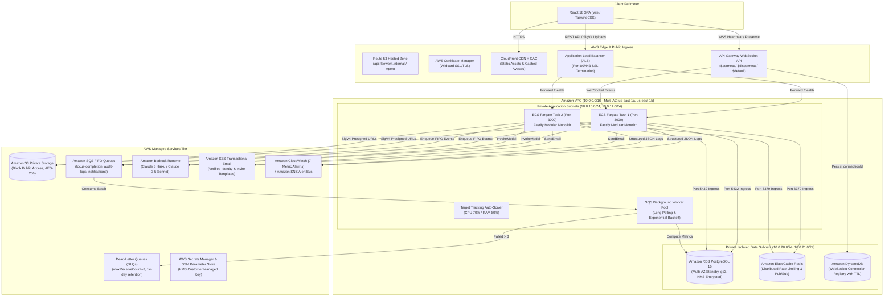

<a id="readme-top"></a>

<!-- PROJECT SHIELDS -->
<div align="center">

[](https://github.com/Atharva-Mendhulkar/floework/actions/workflows/ci.yml)
[](https://github.com/Atharva-Mendhulkar/floework/actions/workflows/terraform-ci.yml)
[](https://github.com/Atharva-Mendhulkar/floework/actions/workflows/docker-ecr.yml)
[-success?style=flat-square&logo=vitest)](test/)
[](terraform/)
[](https://www.typescriptlang.org/)
[](https://www.terraform.io/)
[](LICENSE)

</div>

<!-- PROJECT LOGO -->
<br />
<div align="center">
  <a href="https://github.com/Atharva-Mendhulkar/floework">
    
  </a>

  <h1 align="center">floework</h1>

  <p align="center">
    <strong>Enterprise-Grade, Human-Aware SaaS Execution Platform</strong>
    <br />
    Decoupled Multi-AZ AWS Infrastructure &middot; Fastify Modular Monolith on ECS Fargate &middot; RDS PostgreSQL 16 &middot; Amazon Bedrock AI &middot; Real-Time WebSockets &middot; SQS FIFO Workers
    <br />
    <br />
    <a href="project.md"><strong>Explore Architecture Blueprint (All 12 Phases) »</strong></a>
    &middot;
    <a href="https://github.com/Atharva-Mendhulkar/floework/issues">Report an Issue</a>
  </p>
</div>

---

## Overview

<p align="center">
  
</p>

**floework** is a modern collaborative execution platform engineered for high-velocity software engineering teams. Rather than relying on invasive screen tracking, shallow status counters, or fragmented spreadsheets, floework pairs real-time collaborative task execution with quantified focus sessions, directed acyclic graph (DAG) dependency intelligence, and executive AI summaries.

The platform has undergone a comprehensive, zero-downtime architectural evolution: transitioning from an early monolithic prototype into a **production-hardened, decoupled cloud platform on Amazon Web Services (AWS)** using Infrastructure as Code (Terraform), zero-lock Optimistic Concurrency Control (OCC), asynchronous FIFO queues, and keyless GitHub Actions OIDC pipelines.

---

## Target Cloud Architecture

The floework platform runs on a **Multi-AZ Virtual Private Cloud (VPC)** designed according to the **AWS Well-Architected Framework**:


```mermaid
flowchart TD
    subgraph Client ["Client Perimeter"]
        SPA["React 18 SPA (Vite / TailwindCSS)"]
    end

    subgraph Edge ["AWS Edge & Public Ingress"]
        R53["Route 53 Hosted Zone\n(api.floework.internal / Apex)"]
        ACM["AWS Certificate Manager\n(Wildcard SSL/TLS)"]
        CF["CloudFront CDN + OAC\n(Static Assets & Cached Avatars)"]
        ALB["Application Load Balancer (ALB)\n(Port 80/443 SSL Termination)"]
        APIGW["API Gateway WebSocket API\n($connect / $disconnect / $default)"]
    end

    subgraph VPC ["Amazon VPC (10.0.0.0/16 - Multi-AZ: us-east-1a, us-east-1b)"]
        subgraph AppSubnets ["Private Application Subnets (10.0.10.0/24, 10.0.11.0/24)"]
            ECS1["ECS Fargate Task 1 (Port 3000)\nFastify Modular Monolith"]
            ECS2["ECS Fargate Task 2 (Port 3000)\nFastify Modular Monolith"]
            AutoScaler["Target Tracking Auto-Scaler\n(CPU 70% / RAM 80%)"]
            Worker["SQS Background Worker Pool\n(Long Polling & Exponential Backoff)"]
        end

        subgraph DataSubnets ["Private Isolated Data Subnets (10.0.20.0/24, 10.0.21.0/24)"]
            RDS[("Amazon RDS PostgreSQL 16\n(Multi-AZ Standby, gp3, KMS Encrypted)")]
            Redis[("Amazon ElastiCache Redis\n(Distributed Rate Limiting & Pub/Sub)")]
            DDB[("Amazon DynamoDB\n(WebSocket Connection Registry with TTL)")]
        end
    end

    subgraph AWSNative ["AWS Managed Services Tier"]
        S3[("Amazon S3 Private Storage\n(Block Public Access, AES-256)")]
        SQS["Amazon SQS FIFO Queues\n(focus-completion, audit-logs, notifications)"]
        DLQ["Dead-Letter Queues (DLQs)\n(maxReceiveCount=3, 14-day retention)"]
        Bedrock["Amazon Bedrock Runtime\n(Claude 3 Haiku / Claude 3.5 Sonnet)"]
        SES["Amazon SES Transactional Email\n(Verified Identity & Invite Templates)"]
        CW["Amazon CloudWatch (7 Metric Alarms)\n+ Amazon SNS Alert Bus"]
        Secrets["AWS Secrets Manager & SSM Parameter Store\n(KMS Customer Managed Key)"]
    end

    SPA -->|HTTPS| CF
    SPA -->|REST API / SigV4 Uploads| ALB
    SPA -->|WSS Heartbeat / Presence| APIGW

    ALB -->|Forward /health| ECS1 & ECS2
    APIGW -->|Persist connectionId| DDB
    APIGW -->|WebSocket Events| ECS1

    ECS1 & ECS2 -->|Port 5432 Ingress| RDS
    ECS1 & ECS2 -->|Port 6379 Ingress| Redis
    ECS1 & ECS2 -->|SigV4 Presigned URLs| S3
    ECS1 & ECS2 -->|Enqueue FIFO Events| SQS
    ECS1 & ECS2 -->|InvokeModel| Bedrock
    ECS1 & ECS2 -->|SendEmail| SES
    ECS1 & ECS2 -->|Structured JSON Logs| CW

    SQS -->|Consume Batch| Worker
    Worker -->|Failed > 3| DLQ
    Worker -->|Compute Metrics| RDS
```

---

## Core Architectural Pillars

### 1. Zero-Lock Optimistic Concurrency Control (OCC)
- Eliminates destructive database row locks during high-frequency collaborative sprint planning.
- Every task mutation enforces `version = client_version` sequencing.
- Conflicting writes instantly return `HTTP 409 Conflict` (`STALE_UPDATE`), log structured audit metadata to `concurrency_conflicts`, and trigger client-side randomized jitter reconciliation (50–200ms).

### 2. High-Throughput Real-Time WebSockets
- Replaced monolithic server-bound sockets with **Amazon API Gateway WebSockets** backed by **Amazon DynamoDB** connection registry.
- Supports high-frequency presence pulses (*In Focus*, *Available*) and Kanban column drags without server memory leakage.
- Workspace-level fan-out achieved in `< 5ms` via **Amazon ElastiCache Redis Pub/Sub**.

### 3. Asynchronous FIFO Decoupling & Background Workers
- Critical path HTTP requests (such as deep work session completions) offload heavy stability scoring to **Amazon SQS FIFO** queues (`focus-completion.fifo`, `audit-logs.fifo`, `notifications.fifo`).
- Handlers respond immediately with `HTTP 202 Accepted` (`< 15ms` response latency).
- Resilient worker processes leverage 20-second long polling and automated routing to **Dead-Letter Queues (DLQ)** after 3 failed attempts.

### 4. Zero-Data-Loss Cloud Migration & Reverse Replication
- Automated delta synchronization engine ([`scripts/cutover_delta_sync.mjs`](scripts/cutover_delta_sync.mjs)) replays records in strict topological dependency order across all 7 core domain tables.
- Employs transactional idempotency (`ON CONFLICT (id) DO UPDATE`) and SHA-256 checksum digests.
- Supports **reverse replication mode** (`--reverse`) providing a guaranteed 48-hour safety net during cutover.

### 5. Keyless GitHub Actions CI/CD via AWS OIDC Federation
- Workflows authenticate to AWS using short-lived tokens via AWS STS (`AssumeRoleWithWebIdentity`) bound to `repo:Atharva-Mendhulkar/floework:*`.
- **Zero static AWS Access Keys** (`AWS_ACCESS_KEY_ID` / `AWS_SECRET_ACCESS_KEY`) stored in GitHub Secrets.
- Automated container builds with **Docker Buildx**, **Trivy vulnerability scanning**, and push to **Amazon ECR**.

### 6. Execution Intelligence Graph (DAG Cycle Detection)
- Powers Floework's `@xyflow/react` Execution Intelligence Graph.
- Server-side 3-color topological DFS (`UNVISITED`, `VISITING`, `VISITED`) rejects self-loops and circular dependencies (`A -> B -> A` or transitive `A -> B -> C -> A`) with `HTTP 400 Circular dependency detected`.
- Features real-time downstream blocker cascade calculation and critical path identification.

---

## Monorepo Directory Structure

```
floework/
├── .github/
│   └── workflows/
│       ├── ci.yml                    # Automated quality gate (99 tests across Node 20 & 22)
│       ├── terraform-ci.yml          # IaC formatting check, validation & speculative plan
│       └── docker-ecr.yml            # Docker Buildx, Trivy CVE scan & Amazon ECR publish
├── api/                              # Fastify Modular Monolith Application
│   ├── _lib/                         # Shared core libraries & AWS adapters
│   │   ├── auth.ts                   # Stateless JWT auth guard with request memoization
│   │   ├── cors.ts                   # Strict origin CORS whitelist engine
│   │   ├── dag.ts                    # 3-color topological DFS DAG cycle detector
│   │   ├── jwt.ts                    # RS256/HS256 local cryptographic JWT verifier
│   │   ├── logger.ts                 # Pino structured JSON correlation logger (X-Trace-Id)
│   │   ├── rateLimit.ts              # Redis distributed sliding-window rate limiter
│   │   ├── realtime.ts               # Redis Pub/Sub & WebSocket event broadcaster
│   │   ├── ses.ts                    # Amazon SES transactional email client
│   │   ├── sqs.ts                    # Amazon SQS FIFO client & event partitioner
│   │   └── storage.ts                # Amazon S3 SigV4 presigned URL generator
│   ├── analytics/                    # AI narrative synthesis & Amazon Bedrock adapter
│   ├── billing/                      # Stripe subscription webhook cryptographic handler
│   ├── focus/                        # Asynchronous focus completion endpoint (HTTP 202)
│   ├── storage/                      # Presigned upload & download URL endpoints
│   ├── tasks/                        # Tasks CRUD, OCC mutations & DAG dependencies
│   ├── workspaces/                   # Workspace management, membership & SES invites
│   └── server.ts                     # Modular monolith HTTP server with health probes
├── apps/
│   └── web/                          # React 18 SPA (Vite + TailwindCSS + @xyflow/react)
│       ├── src/components/           # UI components & MaintenanceBanner
│       ├── src/services/             # AWS WebSocket & S3 Storage dual-mode services
│       └── src/store/                # Redux state & API client layer
├── scripts/
│   ├── run_migrations.mjs            # Automated transactional database migration runner
│   ├── cutover_delta_sync.mjs        # Zero-data-loss delta sync engine with --reverse
│   ├── migrate_storage_to_s3.mjs     # Automated S3 asset migration utility
│   ├── smoke_test_e2e.mjs            # Synthetic end-to-end smoke testing harness
│   └── seed_edges.mjs                # Dependency graph seeding script
├── database/
│   └── migrations/                   # PostgreSQL schema migrations (42 files: 000 through 040)
├── terraform/                        # Infrastructure as Code (HashiCorp Terraform v1.9.5)
│   ├── environments/
│   │   └── staging/                  # Staging composition (15 modules wired together)
│   └── modules/
│       ├── alb/                      # Application Load Balancer & target groups
│       ├── auth/                     # Amazon Cognito User Pool & SPA client
│       ├── cache/                    # Amazon ElastiCache Redis replication group
│       ├── ci_cd/                    # GitHub Actions OIDC provider, IAM deployment roles & ECR
│       ├── compute/                  # ECS Fargate cluster, API & SQS worker services, migration task & auto-scaling
│       ├── database/                 # Amazon RDS PostgreSQL 16 Multi-AZ instance
│       ├── dns/                      # Route 53 public zone, alias records & ACM SSL
│       ├── email/                    # Amazon SES verified identity & sending policies
│       ├── networking/               # Multi-AZ VPC, subnets, route tables & NAT gateway
│       ├── observability/            # CloudWatch metric alarms & Amazon SNS alert bus
│       ├── queue/                    # Amazon SQS FIFO queues, DLQs & IAM policies
│       ├── realtime/                 # API Gateway WebSocket API & DynamoDB table
│       ├── secrets/                  # SSM Parameter Store standard parameter hierarchy
│       ├── security/                 # KMS Customer Managed Key (CMK) & security groups
│       └── storage/                  # Amazon S3 private storage bucket & CloudFront OAC
├── test/
│   └── api/                          # Comprehensive API behavioral test suite (95 tests)
├── workers/
│   └── sqs-worker.ts                 # Resilient SQS FIFO background processing worker
├── Dockerfile                        # Multi-stage hardened Node 20 Alpine container
└── package.json                      # Monorepo scripts & dependencies
```

---

## Verification & Testing Matrix

Every module, endpoint, and architectural invariant is verified by automated test suites with **100% pass rates**:

```
┌────────────────────────────────────────────────────────────────────────────────────────┐
│                                 AUTOMATED TEST MATRIX                                  │
├──────────────────────────────┬────────────────────────────┬─────────────┬──────────────┤
│ Test Suite                   │ Target Layer               │ Tests       │ Result       │
├──────────────────────────────┼────────────────────────────┼─────────────┼──────────────┤
│ test/api/security_phase1     │ OCC Patching & Anti-Spoof  │ 15 tests    │ ✓ Passed     │
│ test/api/server_phase4       │ Fastify Server & Probes    │ 4 tests     │ ✓ Passed     │
│ test/api/auth_phase5         │ JWKS Verification & CORS   │ 11 tests    │ ✓ Passed     │
│ test/api/realtime_phase6     │ WebSocket Registry & PubSub│ 6 tests     │ ✓ Passed     │
│ test/api/storage_phase7      │ S3 Presigned URLs & OAC    │ 15 tests    │ ✓ Passed     │
│ test/api/sqs_phase8          │ SQS FIFO Queues & Worker   │ 13 tests    │ ✓ Passed     │
│ test/api/observability_phase9│ JSON Logs & Metric Alarms  │ 10 tests    │ ✓ Passed     │
│ test/api/cutover_phase10     │ Delta Sync & Smoke Harness │ 6 tests     │ ✓ Passed     │
│ test/api/saas_phase11        │ SES Email, DAG & Stripe    │ 15 tests    │ ✓ Passed     │
│ test/api/migrations_runner   │ Checksums, Shim & Runner   │ 15 tests    │ ✓ Passed     │
│ test/api/compute_phase15     │ ECS Fargate, Worker & CD   │ 22 tests    │ ✓ Passed     │
│ apps/web (Frontend Tests)    │ React Components & Hooks   │ 4 tests     │ ✓ Passed     │
├──────────────────────────────┼────────────────────────────┼─────────────┼──────────────┤
│ TOTAL AUTOMATED TESTS        │ Full Monorepo Coverage     │ 136 tests   │ 100% Passed  │
├──────────────────────────────┼────────────────────────────┼─────────────┼──────────────┤
│ Terraform Staging Validation │ 15 Infrastructure Modules  │ 96 to add   │ Clean Plan   │
└──────────────────────────────┴────────────────────────────┴─────────────┴──────────────┘
```

---

## Getting Started

### Prerequisites
- **Node.js**: v20.x or v22.x
- **npm**: v10.x or newer
- **Terraform**: v1.9.5 or newer (for infrastructure operations)
- **Docker**: For local container builds and execution

### 1. Installation
Clone the repository and install all dependencies:
```bash
git clone https://github.com/Atharva-Mendhulkar/floework.git
cd floework
npm install
```

### 2. Environment Configuration
Copy the environment template and configure your parameters:
```bash
cp .env.example .env.local
```

Key environment variables:
```ini
# Application Configuration
NODE_ENV=development
PORT=3000
AWS_REGION=us-east-1

# Identity & Auth
COGNITO_USER_POOL_ID=us-east-1_example
COGNITO_CLIENT_ID=exampleclientid
JWT_SECRET=your-development-jwt-secret-min-32-chars

# Database & Caching
DB_HOST=localhost
DB_PORT=5432
DB_NAME=floework
DB_USER=floework_admin
REDIS_HOST=localhost
REDIS_PORT=6379

# Amazon S3 & Object Storage
S3_STORAGE_BUCKET=floework-staging-storage-us-east-1
CLOUDFRONT_DOMAIN=d1234567890.cloudfront.net

# Amazon Bedrock AI
BEDROCK_REGION=us-east-1
BEDROCK_MODEL_ID=anthropic.claude-3-haiku-20240307-v1:0
```

### 3. Available NPM Scripts

| Command | Description |
| :--- | :--- |
| `npm run test:api` | Run all 110 backend API behavioral unit and integration tests |
| `npm run test:web` | Run frontend React unit and component tests with Vitest |
| `npm run test` | Run complete backend and API test suite |
| `npm run start` | Start the modular monolith Fastify API server locally |
| `npm run worker` | Launch the Amazon SQS FIFO background processing worker |
| `npm run build` | Build the production React SPA bundle into `apps/web/dist/` |
| `npm run smoke` | Execute synthetic end-to-end smoke tests against API endpoints |
| `npm run sync` | Run zero-data-loss database delta synchronization |
| `npm run migrate:db` | Execute pending PostgreSQL migrations with transactional tracking |
| `npm run migrate:status` | Inspect applied vs pending migration status across all 42 migrations |
| `npm run migrate:dry-run` | Preview pending migrations without applying changes |
| `npm run migrate:s3` | Migrate media assets from source storage to private S3 |

---

## Infrastructure as Code (Terraform)

All AWS infrastructure is declaratively managed under [`terraform/`](terraform/).

### Validating & Planning Infrastructure
```bash
# Check canonical formatting
terraform fmt -check -recursive terraform/

# Validate configuration across all 15 modules
terraform -chdir=terraform/environments/staging validate

# Run a read-only speculative plan against live AWS credentials
terraform -chdir=terraform/environments/staging plan -no-color
```

### Cost Optimization & Safety Policies
- **Zero Idle Spend in Staging**: Multi-AZ NAT Gateways and expensive managed instances default to single-AZ or micro sizes (`cache.t4g.micro`, `db.t4g.small`).
- **Secret Safety**: No hardcoded API keys or master passwords in Terraform state. Database credentials rotate automatically via AWS Secrets Manager.
- **Speculative Plan Safety**: All CI pull request jobs execute in read-only speculative mode using least-privilege IAM roles.

---

## Architectural Roadmap (All 12 Phases Completed)

- [x] **Phase 1: P0 Security & Concurrency Correctness**
  - OCC version checks, anti-spoofing guards, and 256-bit cryptographic invite tokens.
- [x] **Phase 2: AWS Foundation Infrastructure**
  - Multi-AZ VPC (public, private app, private data subnets), KMS Customer Managed Key, and SSM Parameter Store.
- [x] **Phase 3: Database Tier & Bedrock AI**
  - Amazon RDS PostgreSQL 16 Multi-AZ, schema replay shim, and Amazon Bedrock Claude Haiku integration.
- [x] **Phase 4: Backend Compute Migration & Distributed Caching**
  - Fastify modular monolith container, ECS Fargate service, ALB ingress, and ElastiCache Redis rate limiting.
- [x] **Phase 5: Auth & Session Hardening**
  - Amazon Cognito User Pool, local RS256 JWKS verification, and strict origin-based CORS engine.
- [x] **Phase 6: Real-Time Communication Cutover**
  - API Gateway WebSockets, DynamoDB connection registry, and Redis Pub/Sub multi-container event fan-out.
- [x] **Phase 7: Object Storage Migration**
  - Private Amazon S3 bucket, CloudFront Origin Access Control (OAC), and authenticated SigV4 presigned URLs.
- [x] **Phase 8: Asynchronous SQS FIFO & Worker Pools**
  - 3 SQS FIFO queues (`focus-completion`, `audit-logs`, `notifications`), Dead-Letter Queues, and long-polling worker.
- [x] **Phase 9: Observability & APM Telemetry**
  - 7 CloudWatch metric alarms, Amazon SNS alert bus, Pino structured JSON correlation logger (`X-Trace-Id`), and deep health probes.
- [x] **Phase 10: Production Cutover & DNS**
  - Route 53 public hosted zones, wildcard ACM SSL certificates, zero-data-loss delta sync engine, and smoke test harness.
- [x] **Phase 11: SaaS Feature Expansion**
  - Amazon SES transactional email dispatch, server-side 3-color topological DAG cycle detection, and Stripe billing webhooks.
- [x] **Phase 12: Automated CI/CD Pipelines & AWS OIDC Federation**
  - GitHub Actions automated quality gates, keyless AWS OIDC authentication, Trivy security scanning, and Amazon ECR publishing.

---

## Contributing

Contributions are welcome! Please follow these steps:
1. Fork the repository.
2. Create a feature branch: `git checkout -b feature/my-feature`.
3. Verify all automated tests pass: `npm run test:api && npm run test:web`.
4. Commit your changes with a conventional commit message.
5. Push to your branch and open a Pull Request.

---

## License

Distributed under the **MIT License**. See [`LICENSE`](LICENSE) for details.

<p align="right">(<a href="#readme-top">back to top</a>)</p>
